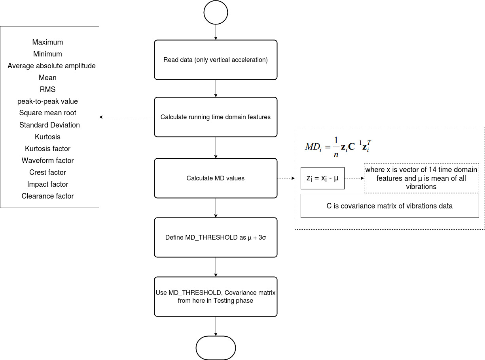
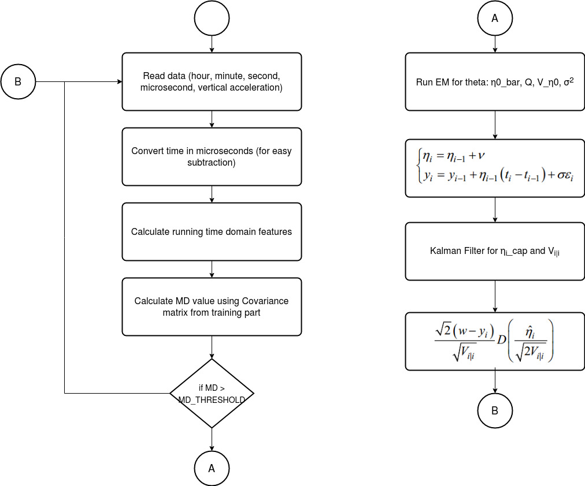

# RUL-Prediction

## A Two-stage Data-driven Based Prognostic Approach for Bearing Degradation

This is a solution to the <a href="https://www.scribd.com/document/427205852/IEEEPHM2012-Challenge-Details-pdf">IEEE PHM 2012 Prognostic Challenge</a>. It focused on the estimation of the <b>Remaining Useful Life(RUL)</b> of ball bearings, a critical problem among industrial machines, strongly affecting availability, security and cost effectiveness of mechanical systems.
  
We use a two-stage process for predicting the RUL using a single statistic derived from 14 time-domain features of the observed vibration signals by modelling the degradation process as a Wiener process and continuously updating prior parameters of the underlying linear state-space model of degradation.

- Multiple time-domain features were fused into one index by calculating the <b>Mahalanobis distance</b> from a known healthy state.
- The <b>Weiner process</b> was used to model the degradation process of the ball bearings
- The Mean and Variance of the drift coefficient used Weiner process was predicted using the <b>Kalman filter</b>
- The <b>Expectation Maximization(EM) algorithm</b> was used to estimate the unknown parameters which in turn are used in the Kalman Filter
- <b>Rauch-Tung-Striebel(RTS) Smoother</b> is used for fixed interval smoothing, taking into consideration both, the past and future values to predict the current one.

### Training

### Testing

**_Current code has commented the eqn (9) and KF additional update_**

## References
1. <a href="https://ieeexplore.ieee.org/document/7420685">A Two-stage Data-driven Based Prognostic Approach for Bearing Degradation Problem</a> by Yu Wang, Yizhen Peng, Yanyang Zi, Xiaohang Jin, Kwok-Leung Tsui
2. <a href="https://www.sciencedirect.com/science/article/abs/pii/S0888327012003226">A Wiener-process-based degradation model with a recursive filter algorithm for remaining useful life estimation</a> by Xiao-Sheng Si, Wenbin Wang, Chang-Hua Hu, Mao-Yin Chen, Dong-Hua Zhou